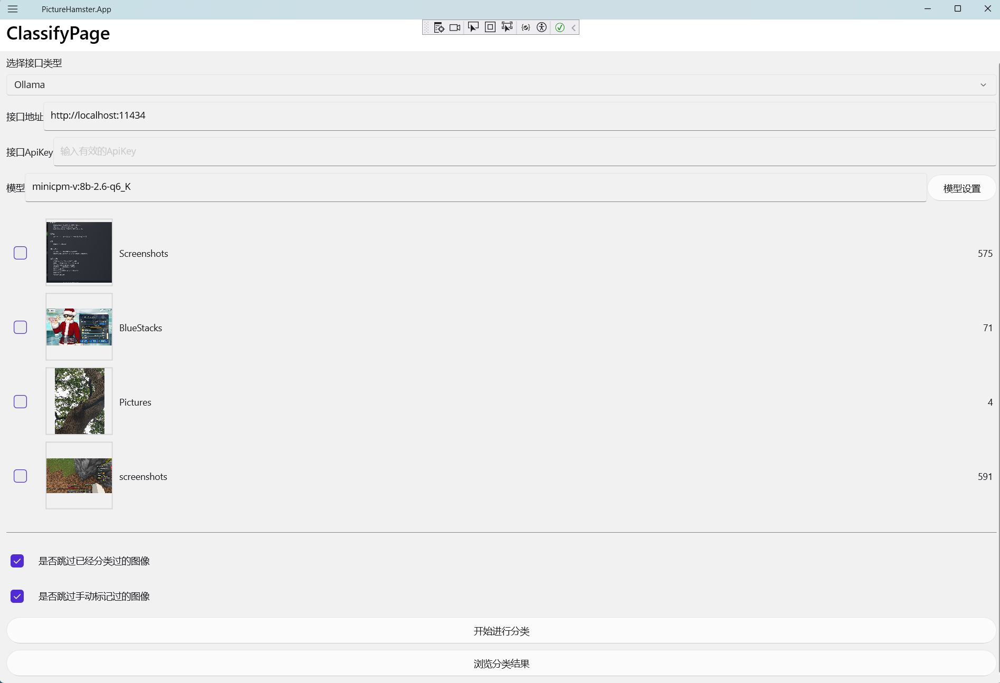

# PictureHamster

## 项目简介
图片仓鼠是一个图像分类存储软件，支持通过对接多模态LLM模型接口，进行自动图像分类，支持部署在电脑和移动设备上。   
目前支持OpenAI和Ollama类型的接口(通过[微软语义内核](https://learn.microsoft.com/semantic-kernel/)对接)。   
考虑到隐私问题，推荐将这个程序配合私有部署的Ollama或其它AI服务使用。

- 分类-Windows

- 查找-Android

## 待完成的内容     
- [x] 支持导入单个或整个文件夹的图片，自动导入已保存文件夹的新图片。
- [x] 支持配置ollama或openapi类型的LLM模型接口，并对导入的图片进行自动分类处理。
- [x] 支持显示类别信息和每个类别下包含的图片，提供按类别导出/分享图片等功能。
- [ ] 支持配置分类时相近类别的合并。
- [x] 支持按关键内容/详情/类别检索特定图片。
- [x] 测试验证在Android平台上的运行。
- [ ] 一套更加风格化的UI界面。
- [ ] 本地化支持。
- [ ] 详细使用手册。

## 环境要求
- 开发环境：[.NET 9 SDK](https://dotnet.microsoft.com/download/dotnet/9.0)
- 运行环境：Android 5.0 (API 21) +  / Windows 10 + , 具体见[MAUI应用支持的平台](https://learn.microsoft.com/dotnet/maui/supported-platforms?view=net-maui-9.0)
